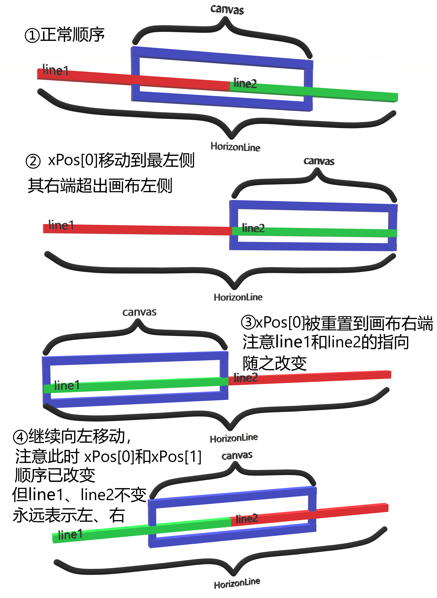

# offline.js

---

前置信息：如下是 *Dino* 使用的素材图片。

## HorizonLine

作用：在屏幕上绘制会动的地平线。该对象是单例。地平线看起来是一条无限长的、会动的线，但实际上素材图片中的地平线素材是有限长的。该对象会绘制两小段地平线，每截的长度都相当于`canvas`画布的长度，在游戏进行过程中，相关函数先从画布的最左端创建该实例，然后让两小段一起不断向左移动。在某一小段的最右端移出画布的最左端后，又将这一小段整体被移动到画布的最右端。如此循环往复，就绘制出了用户眼中无限长的地平线。

#### 构造函数

参数：`canvas`、`lineConfig` 

其中，`canvas`是地面将绘制到的画布（ssh说了不要管所有关于这个的东西），而`lineConfig` 是包含配置信息的JSON对象，包含`SOURCE_X`和`SOURCE_Y`两个属性，分别指定了**代表地面的图形在素材图片中的位置**。（注意：**不是**地面在屏幕中的位置！）

修改素材图片中地平线素材的同时，修改调用该构造方法时使用的`lineConfig`，可以起到使游戏中的地平线画面发生变化的效果。但是不影响游戏判定等。

该构造函数的调用者是 `Horizon.init()`，其中`Horizon`是用来控制整个背景板（包括星星、云朵、月亮、地平线）的控制器单例，`init`是它的原型链中的函数，在构造函数的最后调用。它使用的`lineConfig`对象是位于 `offline-spirite-definitions.js` 中的 `priteDefinitionByType.LINES`。

```
LINES: [
    {SOURCE_X: 2, SOURCE_Y: 3, WIDTH: 600, HEIGHT: 12, YPOS: 128},
],
```

#### 成员变量

| 变量名             | 含义                                                                                                                                           |
| --------------- | -------------------------------------------------------------------------------------------------------------------------------------------- |
| `spritePos`     | 保存了一份`lineConfig`。                                                                                                                           |
| `canvas`        | 保存了一份`canvas`。                                                                                                                               |
| `bumpThreshold` | 随机地形系数，初始值为0.5。只在构造函数中定义。素材图片中的地形实际上是两段连起来的，第一段的X坐标是2到602，第二段是602到1202.修改它会影响`getRandomType`中返回值为`this.dimensions.WIDTH`或0的概率，从而影响每段地形出现的几率。 |
| `dimensions`    | 描述当前对象绘制在`canvas`中的位置。初始化时保存了一份 `lineConfig`。此后将被`HorizonLine.setSourceDimensions()`根据屏幕是否 HiDPI 进行修改。                                       |
| `sourceXPos`    | 一个2项列表，分别表示该实例控制的两段地平线在素材图片中起点的实际x坐标。实际上，该属性决定了这段地平线的外观是第一类（在素材图片中坐标为2到602）还是第二类（在素材图片中坐标为602到1202）。                                         |
| `xPos`          | 一个2项列表，表示2段地平线在画布上的起点的实际x坐标。                                                                                                                 |
| `yPos`          | 一个数字，表示地平线在屏幕上的实际y坐标。                                                                                                                        |

`xPos`、`yPos`初始化时使用的是空列表和0。此后，构造函数再调用原型链中的`setSourceDimensions`，使用`lineConfig`作为“配置文件”，根据当前屏幕是否是HiDPI来自动设置`xPos`与`yPos`。如果想要修改地平线的位置，不应修改这两个变量的初始化值（这没有意义而且可能出bug），而应该修改`offline-spirite-definitions.js` 中的 `spriteDefinitionByType.LINES`。

**~~不~~温馨提示**：`xPos`、`yPos`都会随着该对象的位置变化而不停地动，而原型链中的成员函数`updateXPos`重置右端超出屏幕的那一段地平线的`xPos`时，同时也会随机重置`sourceXPos`从而重新随机其外观。**与之相对的是，`dimensions`不会动。**

#### 类变量（原型的变量）

| 变量名          | 含义                              |
| ------------ | ------------------------------- |
| `dimensions` | 用来初始化所有`HorizonLine`对象的配置JSON对象 |

需要注意的是，`HorizonLine` 的实例有一个自己的`dimensions`，同时`HorizonLine`这个“类”（实际上是原型）它自己又有一个`dimensions`。不要混淆。后者只在构造函数以外被定义一次，之后再也没用过，用的全都是我也不知道是拿来干啥的，因为我**在整个项目中搜索并确定了**，它真的只在`offline.js`里出现了一次。所有跟真实有关的，用的全是实例的 `this.dimensions`。我严重怀疑这个类变量写在这的唯一作用就是给程序员当个参考。

#### 成员函数（位于原型链中）

| 函数名                                  | 作用                                                                                                                                                                                             |
| ------------------------------------ | ---------------------------------------------------------------------------------------------------------------------------------------------------------------------------------------------- |
| `setSourceDimensions(newDimensions)` | 根据传入的`newDimensions`设定当前实例的 `this.dimensions`、`xPos` 和 `yPos`。与此同时，判断屏幕是否 HiDPI，如果是，自动把长宽尺寸变成两倍，但不修改Y坐标，来适应 HiDPI 。经确认，本项目中，`setSourceDimensions()` 只被 `HorizonLine` 的构造函数调用。参数是 `lineConfig`。 |
| `getRandomType()`                    | 随机返回`this.dimensions.WIDTH`或 0。两者的比例由当前实例的`this.bumpthreshold`决定。它将被用于重设移出屏幕的那一段地平线的`sourceXPos`（也就是决定了其重新获得的外观）。                                                                              |
| `draw()`                             | 把地平线画到`this.canvas`上。从该函数中可以清晰地看到，一个`HorizonLine`实例管理了两段地平线的绘制。但别管canvas，所以别管这函数。ssh说的（                                                                                                        |
| `reset()`                            | 将当前实例控制的第一段地平线的 x 坐标起点重置到  0, 第二段的起点重置到` this.dimensions.WIDTH`。                                                                                                                               |
| `updateXPos(pos, increment)`         | 根据 `increment`计算地平线每帧往左移动的像素数，并以此来更新当前实例控制的两段地平线的 x 坐标范围。如果超出屏幕了，则将其重置到屏幕右端。`pos`表示的是“**列表顺序的**第一段的左端”有没有超出屏幕的左端（这一点可能很迷惑人，比较大脑按摩，下面会专门提到更新方法）。                                                |
| `update(deltaTime, speed)`           | `deltaTime`是两帧之间的时间，`speed`是‘理论游戏速度’。根据这个来计算 `increment` 并调用 `updateXPos()`。                                                                                                                   |

`updateXPos()`只被`update()`调用，而`update()`是根据电脑的帧率来生成的 `increment`，所以这俩连起来也可以看成是“根据当前小恐龙的 ’理论移速‘ 和电脑的帧率，计算地平线每帧往左移动的像素数并根据这个值来更新当前对象的 x 坐标范围，如果超出屏幕了，则将其重置到屏幕右端”。

##### `updateXPos()`更新坐标的方法（重要）

`update()`会将“**列表顺序的**第一段的的左端有没有超出画布的左端”这一信息传入`updateXPos`。

什么是“列表顺序”？我感觉太大脑按摩了，想着应该画个图来解释这个问题。



我们会发现，由于`pos`为 0（`xPos[0] <= 0`，也就是列表中的“第一项”在画布左侧，“第二项”在画布右侧）时，`line1`指向 `xPos[0]` （也就是左边的那一段），而 `line2` 指向 `xPos[1]` （也就是右边的那一段）；而 `pos`为1（`xPos[0] > 0`，也就是列表中的“第一项”在画布右侧，“第二项”在画布左侧）的时候，`line1`指向 `xPos[1]` （还是左边的那一段），而 `line2` 指向 `xPos[0]` （还是右边的那一段）。

在这一基础上，`updateXPos()`每次让`line1`往左移动`increment`个像素的距离，而让`line2`永远等于`line1`加上一个画布的宽度（`this.dimensions.WIDTH`）。就是`line1`和`line2`的指向变化这一点比较烧脑子。


